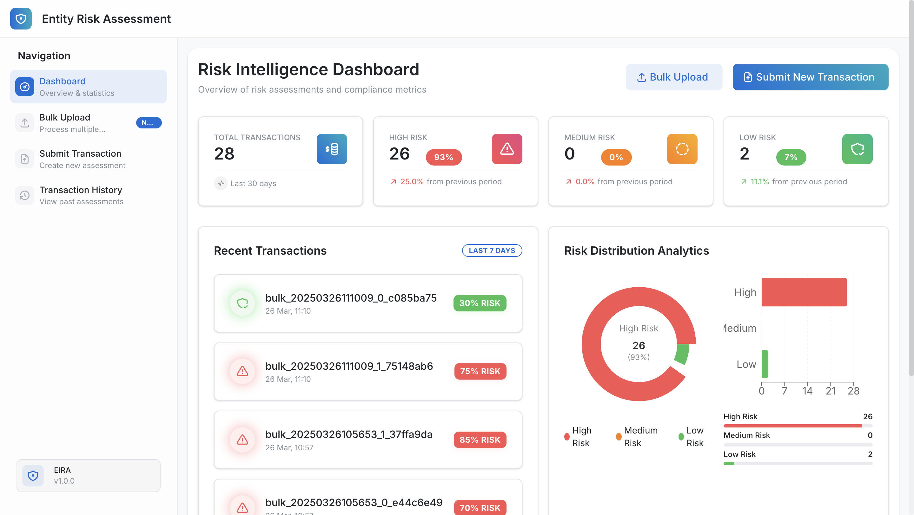

# 🚀 AML Risk Assessment

## 📌 Table of Contents
- [Introduction](#introduction)
- [Demo](#demo)
- [What It Does](#what-it-does)
- [How We Built It](#how-we-built-it)
- [Challenges We Faced](#challenges-we-faced)
- [How to Run](#how-to-run)
- [Tech Stack](#tech-stack)
- [Team](#team)

---

## 🎯 Introduction
The main objective of this project is to develop a sophisticated AI/ML-powered system that automates entity research, verification, and risk scoring. By leveraging Generative AI, multi-source transaction data analysis, and automated workflows, we aim to enhance accuracy, reduce manual effort, and provide a robust risk evaluation framework. This solution will empower analysts with intelligent insights for informed decision-making.

## 🎥 Demo
🔗 [Live Demo](https://eira.indresh.me/)  
📹 [Video Demo](artifacts/demo/ProjectDemo-720.mp4)  

## 🖼️ Screenshots

| | | |
|:-------------------------:|:-------------------------:|:-------------------------:|
|  |  |  |
|  |  |  |
|  |  |  |
|  |  |  |
|  |  |  |
|  |  |  |


## ⚙️ What It Does

```mermaid
%%{
  init: {
    'theme': 'dark',
    'themeVariables': {
      'primaryColor': '#0078D7',
      'primaryTextColor': '#FFFFFF',
      'primaryBorderColor': '#5B9BD5',
      'lineColor': '#5B9BD5',
      'secondaryColor': '#2C3E50',
      'tertiaryColor': '#2980B9',
      'fontFamily': 'Arial, sans-serif'
    },
    'flowchart': {
      'curve': 'basis',
      'diagramPadding': 10
    }
  }
}%%

flowchart TB
    classDef mainNode fill:#0078D7,stroke:#5B9BD5,stroke-width:2px,color:white,font-weight:bold
    classDef enrichNode fill:#7030A0,stroke:#9b59b6,stroke-width:2px,color:white
    classDef sourceNode fill:#00B0F0,stroke:#00B0F0,stroke-width:2px,color:white
    classDef riskNode fill:#C00000,stroke:#C00000,stroke-width:2px,color:white
    classDef outputNode fill:#ED7D31,stroke:#ED7D31,stroke-width:2px,color:white
    
    %% Main workflow
    Transaction["📄 Transaction Data"]:::mainNode
    ExtractEntities["🔍 Extract Entities"]:::mainNode
    EnrichData["📊 Enrich Data"]:::enrichNode
    AssessRisk["⚖️ Risk Assessment"]:::riskNode
    StoreResults["💾 Store Results"]:::outputNode
    SendCallback["🔄 API Callback"]:::outputNode
    
    %% Flow connections
    Transaction --> ExtractEntities --> EnrichData --> AssessRisk --> StoreResults --> SendCallback
    
    %% Data sources
    subgraph DataSources["Intelligence Sources"]
        direction TB
        OpenCorp["🏛️ Corporate Registry"]:::sourceNode
        Sanctions["⚠️ Sanctions Lists"]:::sourceNode
        PEP["👑 PEP Database"]:::sourceNode
        Wikidata["🌐 Entity Networks"]:::sourceNode
        News["📰 Adverse Media"]:::sourceNode
    end
    
    %% Entity groups
    subgraph Entities["Entity Processing"]
        direction TB
        ProcessOrgs["🏢 Organizations"]:::enrichNode
        ProcessPeople["👤 People"]:::enrichNode
        ProcessDiscovered["🔎 Discovered Entities"]:::enrichNode
    end
    
    %% Storage
    subgraph Storage["Data Storage"]
        direction TB
        Neo4j["🕸️ Neo4j Graph DB"]:::outputNode
        KB["📚 Knowledge Base"]:::outputNode
    end
    
    %% Connect subgraphs
    ExtractEntities --> Entities
    Entities --> DataSources
    EnrichData --> DataSources
    AssessRisk --> Storage
    StoreResults --> Storage
```



The DAG workflow processes transactions through six key stages:

1. **Transaction Data** - Receives transaction information from the API
2. **Extract Entities** - Identifies organizations and people using Gemini AI
3. **Enrich Data** - Gathers intelligence from multiple external sources
4. **Risk Assessment** - Analyzes data to calculate risk scores with supporting evidence
5. **Store Results** - Persists findings in structured storage systems
6. **API Callback** - Notifies requesting systems when processing completes

The architecture integrates several components:

- **Entity Processing** - Handles organizations, people, and discovered entities in parallel
- **Intelligence Sources** - Corporate registries, sanctions lists, PEP databases, entity networks, and adverse media
- **Data Storage** - Neo4j graph database for relationship analysis and organized knowledge base


## 🛠️ How We Built It


We utilized **Apache Airflow** for workflow orchestration, **Neo4j** for graph-based data modeling, and **Gemini LLMs** for AI-powered tasks like entity extraction and risk scoring. The frontend was built with React, Vite, and Mantine, while the **backend** used FastAPI for high performance and scalability.

## 🚧 Challenges We Faced
Key challenges included integrating diverse technologies (Airflow, Neo4j, Gemini), optimizing data pipelines for low latency, and designing an intuitive frontend. Overcoming these required innovative problem-solving, effective collaboration, and rapid iteration.

## 🏃 How to Run
### Prerequisites
- Ensure you have Docker and Docker Compose installed.
- For the frontend, ensure you have Node.js, npm, and yarn installed.

### Steps to Run the Project
1. **Clone the repository**  
   ```sh
   git clone https://github.com/ewfx/aidel-tech-vi-kings
   cd aidel-tech-vi-kings
   ```

2. **Set up the environment variables**  
   Navigate to the `src` directory and create a `.env` file by copying the `.env.example` file. Update the variables in the `.env` file as needed:  
   ```sh
   cd code/src
   cp .env.example .env
   ```

3. **Create the `src/data/pep` folder and copy the `pep_data.csv` file**  
   Create a folder named `pep` inside the `src/data` directory and copy the `pep_data.csv` file into it as root:  
   ```sh
   sudo mkdir -p data/pep
   sudo cp /path/to/pep_data.csv data/pep/
   ```

4. **Set up the backend**  
   Start the backend services using Docker Compose:  
   ```sh
   docker-compose up --build
   ```

5. **Set up the frontend**  
   - Navigate to the `client` directory.  
   - Replace the `API_URL` in the `constants.ts` and `transactionApi.ts` files with the appropriate backend API URL (e.g., `http://localhost:<backend-port>`).  
   - Install dependencies and start the development server:  
   ```sh
   cd client
   # Replace API_URL in constants.ts and transactionApi.ts
   nano code/src/client/src/api/constants.ts
   nano code/src/client/src/api/transactionApi.ts
   # Install dependencies and start the server
   yarn
   yarn dev
   ```

5. **Access the application**  
   - The backend API will be available at `http://localhost:8000`  
   - The Airflow UI will be available at `http://localhost:8080`.
   - The Neo4j UI will be available at `http://localhost:7474`.
   - The frontend will be available at `http://localhost:5173`.

### Steps to Run Tests
1. **Set up the testing environment**  
   Create a virtual environment and install the required dependencies:  
   ```sh
   cd code/test
   make setup
   ```

2. **Run all tests**  
   Execute all test suites (BDD, unit, and API tests):  
   ```sh
   make test-all
   ```

3. **Run specific tests**  
   - **BDD tests**:  
     ```sh
     make bdd
     ```
   - **Unit tests**:  
     ```sh
     make unit
     ```
   - **API tests**:  
     ```sh
     make api
     ```

4. **Generate a coverage report**  
   Create a test coverage report:  
   ```sh
   make report
   ```

5. **Clean up test artifacts**  
   Remove generated files and reports:  
   ```sh
   make clean
   ```

## BDD Testing

The system includes comprehensive behavior-driven development (BDD) tests to verify key functionality. These tests use the [Behave](https://behave.readthedocs.io/) framework to define scenarios in natural language that both technical and non-technical stakeholders can understand.

### Test Categories

The BDD tests cover the following key risk assessment capabilities:

1. **Sanctions Detection**: Identifying transactions involving sanctioned entities or countries
2. **PEP Detection**: Recognizing Politically Exposed Persons (PEPs) and their connections
3. **Shell Company Detection**: Identifying patterns consistent with shell companies
4. **Network Analysis**: Analyzing relationships between entities in transactions
5. **Data Enrichment**: Validating data retrieval from various sources
6. **Complex Risk Detection**: Identifying multi-faceted risk scenarios
7. **Multi-Jurisdictional Risk**: Assessing risks across multiple jurisdictions 

### Running BDD Tests

```bash
cd tests
make setup  # Set up virtual environment and install dependencies
make bdd    # Run BDD tests
```

Or run an individual feature file:

```bash
cd tests
./venv/bin/behave features/sanctions_detection.feature
```

### Example BDD Test Case

Below is an example test scenario from our test suite that verifies the system's ability to detect a sanctioned organization:

```gherkin
Feature: Sanctions Detection
  As a financial compliance officer
  I want to identify transactions involving sanctioned entities
  So that I can block prohibited transactions

  Scenario: Detecting a sanctioned organization
    Given a transaction with the following content:
      """
      Transaction ID: TEST-SANC-002
      Date: 2023-09-21 14:30:00

      Sender:
      Name: European Trade Solutions GmbH
      Account: DE89 3704 0044 0532 0130 00 (Deutsche Bank)
      Address: Friedrichstrasse 123, Berlin, Germany

      Receiver:
      Name: Sberbank of Russia
      Account: RU12 3456 7890 1234 5678 9012
      Address: Moscow, Russia

      Amount: $750,000 USD
      Transaction Type: SWIFT Transfer
      Reference: Equipment Purchase Contract #ER-789

      Additional Notes:
      Transfer related to energy sector equipment
      """
    When I submit the transaction
    And I wait for the transaction to complete
    Then the transaction status should be "completed"
    And the risk score should be at least 0.8
    And the extracted entities should include:
      | European Trade Solutions GmbH |
      | Sberbank of Russia           |
    And the reasoning should include any of:
      | sanction         |
      | russia           |
      | restricted       |
```

This test verifies that:
1. The system can process a transaction involving a sanctioned entity (Sberbank of Russia)
2. The transaction is properly analyzed and completed
3. The risk score meets the minimum threshold of 0.8
4. The system correctly extracts the relevant entities
5. The reasoning includes key terms related to sanctions

### Test Data Validation

The tests also verify that the system correctly collects and processes data from multiple sources:

```gherkin
And the assessment data should include the transaction text
And the assessment data should include organization "European Trade Solutions GmbH"
And the assessment data should include organization "Sberbank of Russia"
And organization "Sberbank of Russia" should have data from "sanctions"
And organization "Sberbank of Russia" should have data from "wikidata"
And at least 1 sanctions results should be included in the assessment data
```

These validation steps ensure that:
1. The original transaction text is preserved
2. All organizations are correctly identified and stored
3. Sanctions data is retrieved for sanctioned entities
4. Additional enrichment data is collected from Wikidata
5. The minimum expected number of sanctions results are found

## 🏗️ Tech Stack
- 🔹 Frontend: React / Vite / Mantine
- 🔹 Backend: FastAPI
- 🔹 Database: Postgres / Redis
- 🔹 Other: Gemini API / Neo4j / Airflow

## 👥 Team
- **Indresh P** - [GitHub](https://github.com/indreshp135/) | [LinkedIn](https://www.linkedin.com/in/indresh-p-21b2581b6/)
- **Pradeep S** - [GitHub](https://github.com/pradeep-707) | [LinkedIn](https://www.linkedin.com/in/pradeep-s-769a4b123/)
- **Sailesh Swaminathan** - [GitHub](https://github.com/0149Sailesh) | [LinkedIn](https://www.linkedin.com/in/sailesh-swaminathan-9187161a2/)
- **Shri Hari L** - [GitHub](https://github.com/Shrihari10) | [LinkedIn](https://www.linkedin.com/in/shri-hari-l/)
- **Raja Kumar S** - [GitHub](https://github.com/theloganhugh/) | [LinkedIn](https://www.linkedin.com/in/s-raja-kumar-96ba29191/)
